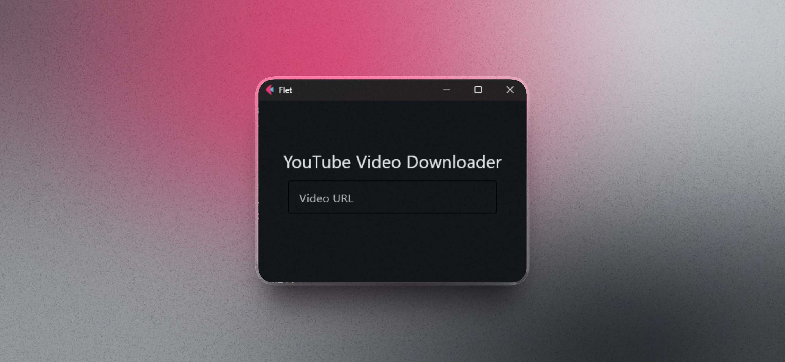

# YouTube Video Downloader (Flet + yt-dlp)

Una aplicación de escritorio minimalista construida con Python que permite descargar videos de YouTube en la mejor calidad disponible simplemente pegando un enlace.

## Instalación

Instala el proyecto con la siguiente linea de comandos:

```bash
  pip install -r requirements.txt
```
